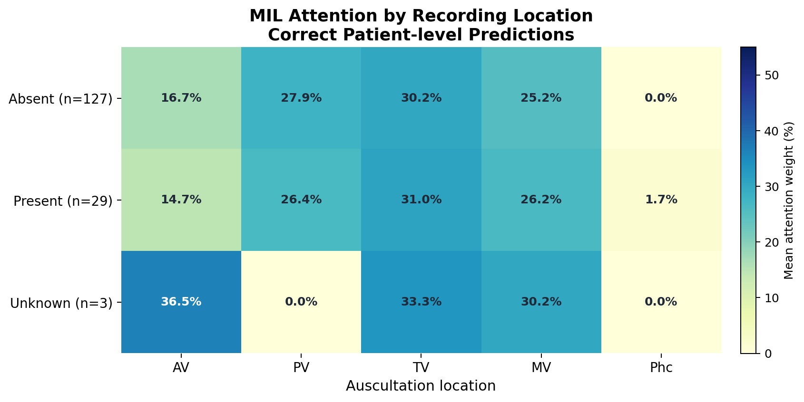
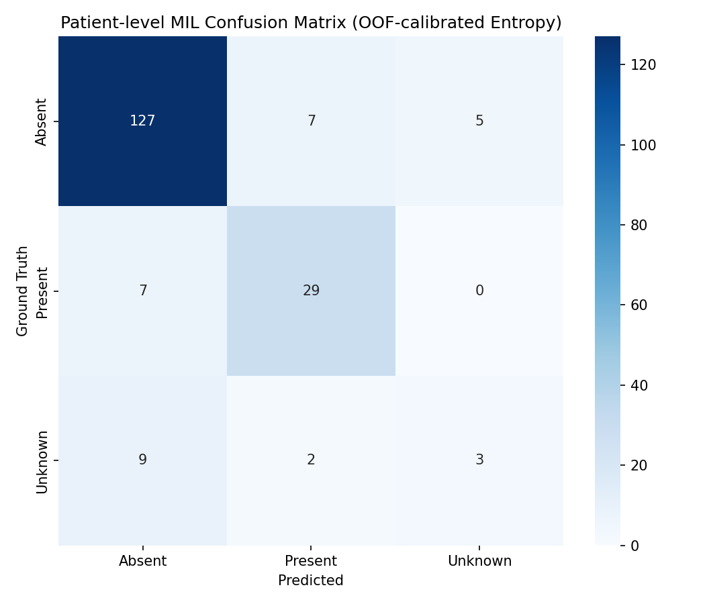
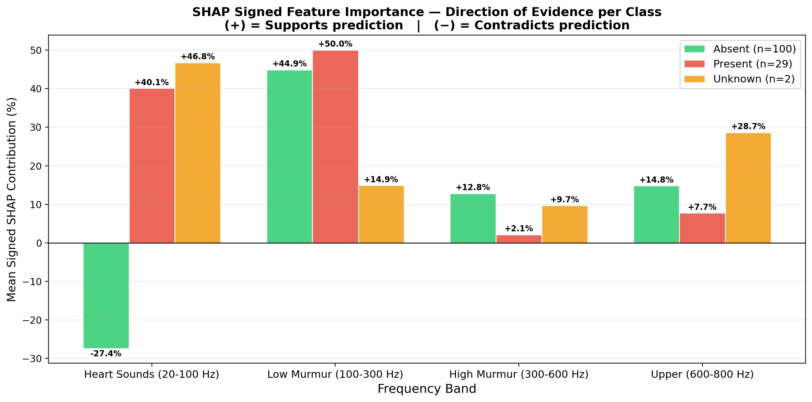

# Patient-Level Explainable Heart Murmur Detection From PCG Recordings

Research code for 3-class heart murmur classification on the PhysioNet/CinC
2022 phonocardiogram dataset. The target is the `Murmur` label with three
classes: `Absent`, `Present`, and `Unknown`.

The project contains a recording-level ResNet18-FGA baseline and a patient-level
multiple-instance learning (MIL) extension that aggregates all available
recording locations for each patient.

> *This repository extends earlier conference work accepted at the 2nd EAI
> International Conference on Responsible Artificial Intelligence and Data
> Science ([EAI RAIDS 2026](https://raids.eai-conferences.org/2026/accepted-papers/)),
> titled "An Explainable Attention-Based Deep Learning Framework for Pediatric
> Heart Murmur Screening Using Phonocardiograms."*

## Highlights

- Patient-level split and evaluation to avoid recording leakage.
- First-10-second preprocessing protocol for consistency with the prior setup.
- Fold-specific train-only normalization statistics.
- ResNet18 backbone with frequency-guided attention and temporal attention
  pooling.
- Patient-level MIL with learned attention over available recordings.
- SHAP frequency-band analysis and MIL attention summaries for interpretability.

## Results

Internal held-out patient-level split with 189 patients
(`Absent=139`, `Present=36`, `Unknown=14`). These are not official hidden
test-set results.

| Method | Level | WA (%) | Present Sens. (%) | Absent Spec. (%) | Unknown Recall (%) |
|---|---:|---:|---:|---:|---:|
| FGA baseline | Patient | 77.56 | 80.56 | 92.81 | 14.29 |
| Patient MIL | Patient | 77.84 | 80.56 | 91.37 | 21.43 |

MIL gives a modest improvement in patient-level weighted accuracy and Unknown
recall, while slightly reducing Absent specificity. Unknown support is small, so
Unknown results should be interpreted with confidence intervals.

Additional patient-level metrics:

| Method | Acc. (%) | Macro-F1 (%) |
|---|---:|---:|
| FGA baseline | 84.66 | 63.60 |
| Patient MIL | 84.13 | 65.24 |

Patient MIL bootstrap confidence intervals:

| Metric | 95% CI |
|---|---:|
| WA | 69.57-85.47 |
| Present Sens. | 67.57-92.31 |
| Absent Spec. | 86.71-95.45 |
| Unknown Recall | 0.00-44.44 |

## Figures

Curated public figures are in `docs/figures/`.







## Repository Layout

```text
src/
  config.py                 Main experiment configuration
  dataset.py                Dataset, preprocessing, normalization, MIL bags
  model.py                  ResNet18-FGA and patient-level MIL models
  train.py                  Recording-level 5-fold training
  evaluate.py               Recording and patient-level evaluation
  train_mil.py              Patient-level MIL training
  evaluate_mil.py           Patient-level MIL evaluation
  compute_shap.py           SHAP analysis for correct patient-level cases
  compute_shap_errors.py    SHAP analysis for patient-level errors
  export_mil_attention.py   MIL attention CSV export
docs/figures/               Curated public figures
PIPELINE.md                 Detailed method pipeline
splits_seed42.json          Fixed patient-level split
```

## Data

Raw PhysioNet/CinC 2022 data is not included in this repository. Download the
dataset from [PhysioNet Challenge 2022](https://physionet.org/content/challenge-2022/1.0.0/)
and place it as:

```text
data/raw/training_data.csv
data/raw/training_data/
```

## Setup

```bash
pip install -r requirements.txt
```

Install the PyTorch build that matches your hardware from the official PyTorch
instructions if the default package does not detect CUDA/MPS correctly.

## Run

Recording-level baseline:

```bash
python src/train.py
python src/evaluate.py
python src/compare_uncertainty.py
```

Patient-level MIL:

```bash
python src/train_mil.py
python src/evaluate_mil.py
python src/export_mil_attention.py
```

Explainability:

```bash
python src/compute_shap.py
python src/compute_shap_errors.py
```

## Notes

Large local artifacts such as raw data, checkpoints, normalization stats,
local archives, and full generated figure folders are intentionally excluded
from version control. Use the curated figures in `docs/figures/` for public
documentation.

## Limitations

- This repository is a research prototype and is not intended for clinical use.
- The `Unknown` class has limited support in the held-out split, so Unknown
  recall has a wide confidence interval.
- The reported results are from an internal patient-level split, not the hidden
  PhysioNet test set.
- Full reproducibility requires downloading the PhysioNet/CinC 2022 dataset and
  regenerating checkpoints locally.
